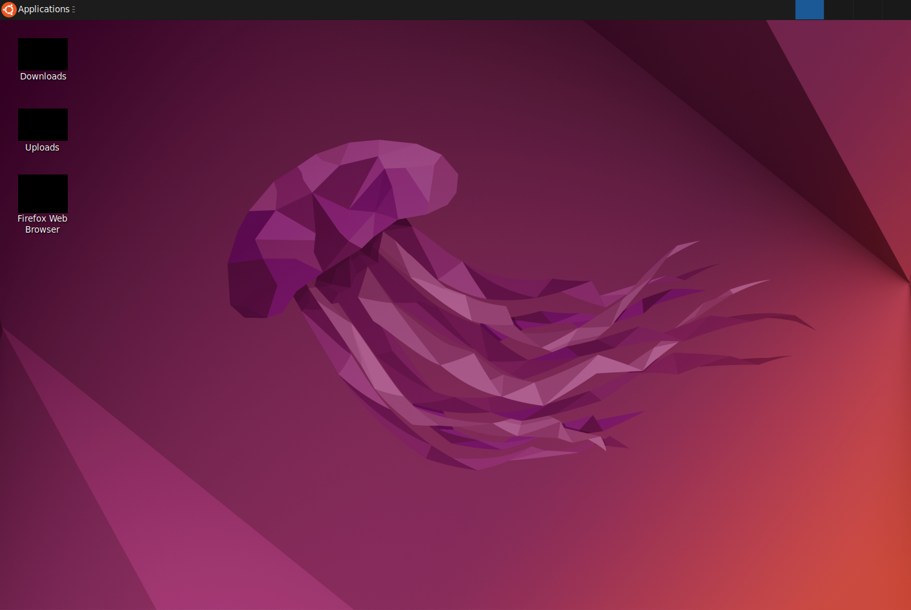

# tertile-cua-redaction

This is my submission for the Cua Global Online Hackthon, co-sponsored by Ollama: a hybrid agent using any cloud model, with local redaction of both screenshots and text from trajectories, using the new perceptive-language model Isaac 0.1 from Perceptron plus your choice of large language model through Ollama.

## Background

### Why redact trajectories?

Last year, I worked on a conference demo called AI Doppelgangers, where we redacted humans from videos and replaced them with AI-generated avatars and voices.  The use case wasn't PII anonymization to keep sensitive data away from LLMs.  It was for long-term storage, to keep valuable user research and customer discovery recordings available to be mined by product teams, while staying compliant with biometric privacy laws, and de-risking in case of a leak or breach.  If the human in the video no longer has their appearance or voice, it's no longer their biometric, but we can still watch their behavior, learn from their activities, etc.

With the growth of agents, the same use case comes up.  Product teams want to understand how AI agents are performing against real-world tasks on their live web sites and internal applications, and those agents need to see real customer and user information in those tasks.  Trajectories can be useful for studying agent behavior, and comparing results across changed prompts or models, but they can also be a legal risk for the business.  A compromised agent server could turn up screenshots with PII in them, or agent responses with customer information written out in them.  If a customer files a deletion request under GDPR, and their customer data is tucked away, still visible in a trajectory from an agent run, that's a huge compliance and legal issue.

If you redact PII from your trajectories, you have less to worry about.

### Why Isaac?

Perceptron released this model just a few days after Cua's Hack the North hackathon, and it promises spatial reasoning, OCR, and, crucially for Cua, conversational pointing, at up to real-time speeds.  The global hackathon seemed like a great chance to experiment with it.

## About this agent

My submission demonstrates this using Perceptron's new Isaac 0.1 perceptive-language model, and your choice of large language model through Ollama.  I'm using the stock Cua `agent_examples.py`, which has tasks for opening up a browser, navigating GitHub, etc.

I've added a custom trajectory saver that spins up a local instance of Isaac via its Huggingface implementation to identify and redact whatever you prompt it to.  It also calls out to Ollama, defaulting to Gemma3-4B, to redact any text you prompt.

For the purposes of this demo, since I'm using the stock Cua `agent_examples.py`, I'm redacting things that are easily visible in that agent's tasks.  Isaac is prompted to redact any icons it sees, which are present on both the regular desktop view and on websites loaded in Firefox.



Ollama is prompted to redact the word "GitHub" as well as any URLs, which are frequently present in the returned text from the agent.

There are also a couple of tests for applying Isaac in other ways.  You can use it as a grounding model for click tasks.  You can use it as the grounding model in a composed agent.  Both of those are in `isaac-composed-agent-perceptron-sdk.py`.  Isaac is based on Qwen3-1.7B, so it technically has tool-calling, and I got it to call Cua's computer tools, but in my experiments it wasn't really very good at planning.  Thats in `isaac-allinone-agent-huggingface.py`.

## How to run it

You can swap out Isaac's prompt, Ollama's prompt, or Ollama's model by either changing the code or setting some environment variables.

I'm using the local implementation of Isaac because there seems to be an overbilling issue with Perceptron's hosting partner, Features and Labels.  Hopefully that'll get resolved soon, but I can't recommend you try it there until it's fixed, unless you can cover 2,500x the per-token rate. 😬  Because of this, make sure you have at least 10GB of disk space free to download the Isaac model.

Create a new Python virtual environment, and install the dependencies:

```
uv venv --python 3.12
.venv\Scripts\activate
uv pip install torch --torch-backend=auto
uv pip install "cua-agent[all]" cua-computer perceptron hf-xet ollama
```

Then, set up your `agent_examples.py`.  You need to define your Cua computer to start, that's on line 550:

```python
    try:
        # Create a local macOS computer
        computer = Computer(
            use_host_computer_server=True,
            host="gtzs.local",
            os_type="linux",
            verbosity=logging.DEBUG,
        )
```

(I've only tested this with local images.)

Then, define the agent model you want to use, that's on line 578:

```python
        # Create ComputerAgent with new API
        agent = ComputerAgent(
            # Supported models:
            
            # == OpenAI CUA (computer-use-preview) ==
            # model="openai/computer-use-preview",

            # == Anthropic CUA (Claude > 3.5) ==
            # model="anthropic/claude-opus-4-20250514", 
            model="anthropic/claude-sonnet-4-20250514",
            # model="anthropic/claude-3-7-sonnet-20250219",
            # model="anthropic/claude-3-5-sonnet-20241022",

            # == UI-TARS ==
            # model="huggingface-local/ByteDance-Seed/UI-TARS-1.5-7B",
            # model="mlx/mlx-community/UI-TARS-1.5-7B-6bit",
            # model="ollama_chat/0000/ui-tars-1.5-7b",

            # == Omniparser + Any LLM ==
            # model="omniparser+anthropic/claude-opus-4-20250514",
            # model="omniparser+ollama_chat/gemma3:12b-it-q4_K_M",
```

Then, run it!

```
python agent_examples.py
```

Let the agent run for a while, then drag-and-drop your `trajectories\<date>-<model-name>-<id>` folder into [the trajectory player for Cua](https://www.trycua.com/trajectory-viewer), and you'll see the usual screenshots and agent text, but the screenshots will have their icons blacked out, and the word "GitHub" and any URLs in the agent text will be replaced with "\[REDACTED\]" instead.


If you need to [connect to a Cua Docker image or host computer server on another machine](https://discord.com/channels/1328377437301641247/1375964344424333483/1420276590587281499), you can specify the name as the `host=` parameter in your Computer setup code, and monkeypatch it to use that address by specifying `--force-host-address` on the command-line.

If you see the error `WARNING:__main__:Redaction failed in on_screenshot (screenshot_after), writing original: USE_FLASH_ATTENTION was not enabled for build.` and don't have Isaac getting loaded and redacting images, you can [monkeypatch out the use of flash attention](https://github.com/perceptron-ai-inc/perceptron/issues/5) by specifying `--no-flash-attention` on the command-line.

If you want to try different prompts for Isaac or Ollama, or change the model Ollama is using, you can edit the code starting on line 49, or use the equivalent environment variables:

```python
# Single, static prompts to use for the entire run (can override via env)
REDACTION_IMAGE_PROMPT = os.getenv(
    "REDACTION_IMAGE_PROMPT",
    "<hint>BBOX</hint> Identify and outline the various icons visible on the desktop."
)
REDACTION_TEXT_PROMPT = os.getenv(
    "REDACTION_TEXT_PROMPT",
    "What follows is text returned from an LLM.  Replace any instances of the word 'GitHub' or any URLs with '[REDACTED]'. Make no other changes."
)

# Hugging Face model repo (override via env if needed)
HF_ISAAC_PATH = os.getenv("PERC_HF_PATH", "PerceptronAI/Isaac-0.1")

# Choose the Ollama model:tag once (override via env OLLAMA_MODEL)
OLLAMA_MODEL = os.getenv("OLLAMA_MODEL", "gemma3:4b")  # example: "gemma3:8b", "llama3:latest"
```

## Thanks!

I look forward to talking about further experiments with Isaac soon, and if you need someone to dive deep into a technology like perceptive-language models for physical world agents, and research your customer use cases for it, prototype with it, or train you on it, you can find me at https://tertile.one
